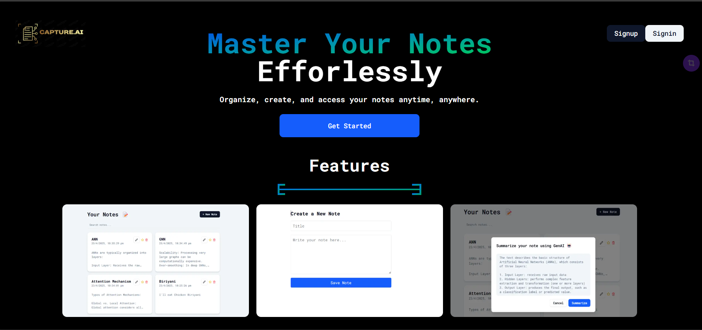

# AI Notes App

A modern, AI-powered note-taking application built with Next.js, Supabase, and React Query. This application allows users to create, manage, and enhance their notes with AI assistance.

## Loom Video
https://www.loom.com/share/22a16566e2e54db1bcf2e7b69fc23eb6?sid=8e1aaa3a-3b8e-4c58-b990-fc456bb7ace1

## Some Screenshots


 

 


## Features

- 📝 Create and manage notes
- 🤖 AI-powered note enhancement
- 🔐 Secure authentication with Supabase
- 🎨 Modern UI with Tailwind CSS
- ⚡ Real-time updates
- 📱 Responsive design

## Tech Stack

- **Frontend Framework:** Next.js 15.3
- **UI Library:** React 18
- **Styling:** Tailwind CSS
- **Database & Auth:** Supabase
- **State Management:** React Query
- **AI Integration:** GROQ SDK
- **UI Components:** Radix UI
- **Type Safety:** TypeScript

## Prerequisites

- Node.js (Latest LTS version)
- npm or yarn
- Supabase account
- GROQ API key

## Getting Started

1. Clone the repository:
   ```bash
   git clone https://github.com/SoumyadeepOSD/capture.ai
   cd project-folder
   ```

2. Install dependencies:
   ```bash
   npm install
   # or
   yarn install
   ```

3. Set up environment variables:
   Create a `.env.local` file in the root directory with the following variables:
   ```
   DB_PASSWORD=<SUPABASE_DB_PASSWORD>
   DB_URL=<SUPABASE_DB_CONNECTION_URL>

   NEXT_PUBLIC_SUPABASE_URL=<GET_FROM_PROJECT_DASHBOARD>
   NEXT_PUBLIC_SUPABASE_ANON_KEY=<GET_FROM_PROJECT_DASHBOARD>
   NEXT_PUBLIC_SITE_URL=http://localhost:3000 // DEPLOYMENT_URL

   OAUTH_CLIENT_ID=<OAUTH_CLIENT_FROM_GOOGLE>
   OAUTH_CLIENT_SECRET=<OAUTH_CLIENT_SECRET>


   NEXT_PUBLIC_GROQ_API_KEY=<GROQ_API_KEY>
   ```

4. Run the development server:
   ```bash
   npm run dev
   # or
   yarn dev
   ```

5. Open [http://localhost:3000](http://localhost:3000) in your browser.

## Available Scripts

- `npm run dev` - Start the development server
- `npm run build` - Build the application for production
- `npm run start` - Start the production server
- `npm run lint` - Run ESLint for code linting

## Project Structure

```
ai-notes-app/
├── app/              # Next.js app directory
├── components/       # Reusable UI components
├── constants/        # Application constants
├── hooks/           # Custom React hooks
├── lib/             # Utility libraries
├── provider/        # Context providers
├── public/          # Static assets
└── utils/           # Helper functions
```

## Contributing

1. Fork the repository
2. Create your feature branch (`git checkout -b feature/amazing-feature`)
3. Commit your changes (`git commit -m 'Add some amazing feature'`)
4. Push to the branch (`git push origin feature/amazing-feature`)
5. Open a Pull Request

## License

This project is licensed under the MIT License - see the LICENSE file for details.

## Acknowledgments

- [Next.js](https://nextjs.org/)
- [Supabase](https://supabase.com/)
- [Tailwind CSS](https://tailwindcss.com/)
- [Radix UI](https://www.radix-ui.com/)
- [GROQ](https://groq.com/)


